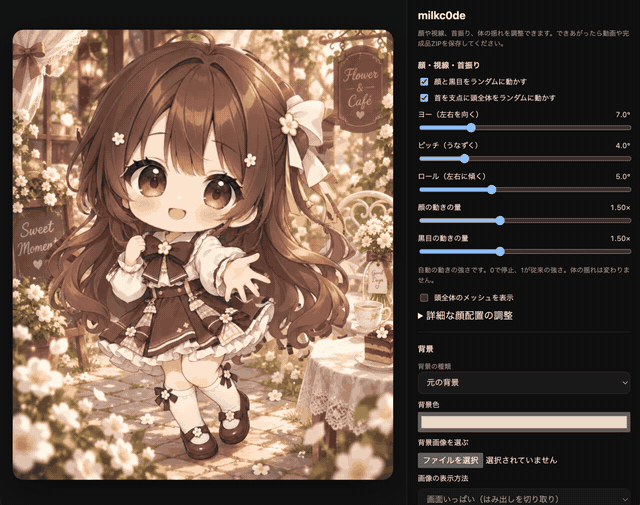

<div align="center">

<h1>ChibiRigKit</h1>

<p>
  <a href="LICENSE"></a>
  
  
</p>



<p><sub>画像1枚から作成 → 好みの動きに調整 → 動画や完成品を保存</sub></p>

<p>
  <a href="#start"><strong>はじめる</strong></a> ·
  <a href="#motion">動きを調整</a> ·
  <a href="#record">録画する</a> ·
  <a href="#save">保存する</a> ·
  <a href="#help">困ったとき</a>
</p>
<p><sub>Created by <a href="https://github.com/milkc0de">milkc0de</a> · <a href="LICENSE">MIT License</a></sub></p>

</div>

---

## イラストから、動くキャラクターへ

ChibiRigKitは、1枚のキャラクター画像から2Dアニメーションを作るツールです。AIが顔・目・髪・服などを分け、ブラウザで動かせるファイルを作ります。完成後はスライダーで調整し、動画やZIPで保存できます。

<table>
<tr>
<td width="50%" valign="top"><strong>✦ 1枚からはじめる</strong><br>通常画像から、顔の下地・閉じ目・閉じ口の差分を準備。</td>
<td width="50%" valign="top"><strong>✦ 表情が動く</strong><br>まばたき、ランダムな顔向き、黒目の動きをそれぞれ調整。</td>
</tr>
<tr>
<td valign="top"><strong>✦ 髪も、体も、首も</strong><br>髪や服の揺れに、左右・上下・傾きの首振りを重ねる。</td>
<td valign="top"><strong>✦ 背景を着せ替える</strong><br>単色・好きな画像・透明背景を切り替える。</td>
</tr>
<tr>
<td valign="top"><strong>✦ 動画にして保存</strong><br>1〜60秒のWebM録画。進み具合の表示と途中中止に対応。</td>
<td valign="top"><strong>✦ 完成品を持ち出す</strong><br>動きの設定はJSONに。プレビューと画像一式はZIPに。</td>
</tr>
</table>

> **作成にはCodex、完成後はブラウザで。**<br>
> AIによる自動作成にはCodexを使います。完成したキャラの再生・調整・録画には、Codexへの接続は不要です。絵柄によっては目や髪の境目などに手直しが必要です。

## 使い方ガイド

| つくる | 仕上げる | 持ち出す |
| :--- | :--- | :--- |
| [01 準備](#start) → [02 セットアップ](#setup) | [05 動きの調整](#motion) | [07 動画を録画](#record) |
| [03 画像を渡す](#create) → [04 開く](#preview) | [06 背景の変更](#background) | [08 設定・完成品を保存](#save) |

---

<a id="start"></a>

## 01 · 最初に用意するもの

作成するパソコンに、次のものを用意してください。

| 必要なもの | 何に使うものか |
| --- | --- |
| キャラクター画像 | 動かしたい元の絵。まずはPNG画像1枚で始められます |
| Python 3.12以降 | 画像を加工し、キャラのファイルを作るためのソフト |
| Node.js 22以降（npmを含む） | 自動作成やプレビュー用サーバーを動かすためのソフト |
| Codex CLI | AIにパーツ分けと調整を依頼するためのツール。ログインが必要です |
| Google Chrome | 完成した動きを表示し、ブラウザ上の検証を行います |

自動作成は、利用中のCodexで `gpt-6-astra` と `high` が使えることを確認してから始まります。利用できない場合は停止します。AIの利用には、利用中のアカウントの制限や料金が適用されます。

以下でいう「ターミナル」は、短い命令を入力するアプリです。macOSでは「ターミナル」、Windowsでは「PowerShell」を使います。`画像のパス` はファイルの保存場所のことです。空白が入っていても扱えるよう、例では `" "` で囲んでいます。

<a id="setup"></a>

## 02 · 初回のセットアップ

ダウンロードしたChibiRigKitを展開し、そのフォルダでターミナルを開きます。次の操作は、初回に一度行います。

使っているOSの項目を開いてください。

<details>
<summary><strong>macOS</strong></summary>

`SETUP.command` を実行します。ターミナルからなら次のように入力できます。

```sh
sh SETUP.command
```

</details>

<details>
<summary><strong>Linux、またはmacOSでshを使う場合</strong></summary>

```sh
sh SETUP.sh
```

</details>

<details>
<summary><strong>Windows（PowerShell）</strong></summary>

```powershell
.\SETUP.ps1
```

</details>

この操作で、ChibiRigKit専用のPython環境（`.venv`）と必要なライブラリを作ります。「セットアップ完了」と表示されたら次へ進みます。途中でエラーが出た場合は、Python・Node.jsが使える状態か確認してください。

Windows版のスクリプトも同梱していますが、現時点でWindows実機での一連の動作確認は未実施です。PowerShellの実行ポリシーで止まった場合は、管理者・組織の設定に従って実行してください。

<a id="create"></a>

## 03 · 画像を渡してキャラを作る

最初は、正面に近いキャラクター画像を1枚用意してください。目や口が見え、髪や手足が切れていない絵だと、分ける場所を判断しやすくなります。

制作時は、入力画像・確認画像・作業指示をCodexへ渡します。通信と操作権限については、[制作の権限と完成品のオフライン利用](docs/ADVANCED.md#制作の権限と完成品のオフライン利用)を参照してください。

macOS：

```sh
sh AUTO_RIG.command "/Users/あなたの名前/Pictures/character.png"
```

Linux・macOSのsh：

```sh
sh AUTO_RIG.sh "/home/あなたの名前/Pictures/character.png"
```

WindowsのPowerShell：

```powershell
.\AUTO_RIG.ps1 "C:\Users\あなたの名前\Pictures\character.png"
```

`あなたの名前` や画像の場所は、自分のパソコンに合わせて置き換えます。処理中はターミナルを閉じずに待ちます。

通常画像しかなくても、下地・閉じ目・閉じ口の差分を準備します。元の入力画像は保持され、作業用の画像は別の場所に保存されます。処理時間は画像や修正回数によって変わります。

結果は `characters/画像の名前/` に作られます。日本語などの名前はフォルダ名として整理されるため、**ターミナルに表示された保存先**を確認してください。

同じ名前のフォルダがすでにある場合は上書きしません。新しい絵で作り直すときは画像名を変えるか、別の出力先を指定します。出力先を細かく指定する方法は[詳しい操作](docs/ADVANCED.md)にあります。

<a id="preview"></a>

## 04 · できあがったキャラを開く

完成品は `dist/<キャラ名>/index.html`、ZIPは `dist/<キャラ名>.zip` に出力します。HTMLをChromeで開くと、動きを見られます。このHTMLには描画用画像が入っています。

サーバーで開きたい場合は、ChibiRigKitのフォルダで次を実行します。

```sh
npm run serve -- --character ./characters/character --port 8080
```

`character` は実際のフォルダ名に変えてください。その後、ブラウザで `http://127.0.0.1:8080/` を開きます。サーバーを終えるときはターミナルで `Ctrl+C` を押します。

<a id="motion"></a>

## 05 · 動きを調整する

画面にはキャラと設定が表示されます。広い画面では左右に、狭い画面では上下に並びます。まずは少しずつ値を変え、顔と体のつながりを見ながら調整してください。

| 設定 | 変わるところ |
| --- | --- |
| 全体モーション量 | 体や髪などの揺れる大きさ |
| 全体モーション速度 | 動く速さ |
| ループ秒数 | 1回の録画の長さ。1〜60秒。動く速さは変わりません |
| 顔と黒目をランダムに動かす | 顔の向きと視線を自動で変える |
| 顔の動きの量 | 自動の顔向きの強さ。0〜4倍。初期値1.5倍 |
| 黒目の動きの量 | 自動の視線移動の強さ。0〜4倍。初期値1.5倍 |
| 首を支点に頭全体をランダムに動かす | 首から上のパーツをまとめて左右・上下に向け、傾ける |
| ヨー（左右を向く） | 左右の首振り。0〜30°。初期値12° |
| ピッチ（うなずく） | 上下の首振り。0〜20°。初期値8° |
| ロール（左右に傾く） | 首の傾き。0〜15°。初期値6° |
| 黒目の左右・上下 | 視線を手動でずらす |
| 自動まばたき | 自動で目を閉じたり開いたりする |

「動きの量」や「ヨー・ピッチ・ロール」を0にすると、その自動の動きを止められます。首振りは顔・黒目の自動移動とは別にON/OFFできます。顔・頭の輪郭・髪・飾りが共有する親メッシュと、ヨー×ピッチの9つの基準配置を補間した表現で、裏側まで作る3Dモデルではありません。

<strong>「揺れの初期値」</strong>は、動きの設定をHTML作成時の値に戻します。顔の各方向の配置を戻す場合は、顔の欄の **「この方向を初期値に戻す」** または **「9方向すべてを初期値に戻す」** を使います。

「頭全体のメッシュを表示」をONにすると、首元を支点とする共通メッシュを確認できます。目・口などの細かい変形は、その内側で行います。

### 顔の配置を細かく直すとき

1. 「詳細な顔配置の調整」を開き、正面・左・右・上・下・斜めの中から直したい方向を選びます。
2. 「選択した方向の配置を編集」をONにします。編集中は自動の首振りが止まります。
3. パーツの位置やメッシュの頂点を調整します。
4. 「この配置を保存」を押します。
5. 他の方向でも必要な分を調整します。

ブラウザ内の保存だけに頼らず、完成後はJSONまたはZIPでも保存してください。

<a id="background"></a>

## 06 · 背景を変える

「背景の種類」で、元の背景・単色・画像・透明を選びます。

- **単色**：背景色を選びます。
- **画像**：PNG・JPEG・WebPを選びます。20MB以下。画面いっぱいにするか、画像全体を見せるかも選べます。
- **透明**：背景を描きません。市松模様は透明部分の確認用で、動画や画像に模様を焼き込みません。
- **元の背景に戻す**：背景変更を解除します。

選んだ背景はこのブラウザに保存されます。保存用の背景画像は長辺1600px以内に縮小されます。元の絵で背景とキャラが一体のままの場合は、リグ作成時に背景の分離が必要です。

<a id="record"></a>

## 07 · 動画を録画する

1. 顔・揺れ・背景を好きな状態にします。
2. 「ループ秒数」を、録画したい長さにします。最大60秒です。
3. 「WebM録画」を押します。
4. 「録画中 12.3 / 60.0 秒」のように、現在位置と終了までの長さが表示されます。
5. 指定した長さで自動停止し、`rig_idle.webm` を保存します。

途中でやめたいときは「録画中止」を押します。途中の動画は保存せず、設定の操作に戻ります。

録画は動きの先頭から始まります。録画中は設定の変更を一時的に止め、終了後に元の再生状態へ戻ります。タブを開いたまま待ってください。

WebMは動画の形式です。編集ソフトによっては変換が必要です。また、透明の扱いは再生・編集ソフトによって異なります。

「ループ秒数」は録画時間でもありますが、ランダムな顔・首振りを含む動画の最初と最後が完全につながることを保証する設定ではありません。

<a id="save"></a>

## 08 · 設定や完成品を保存する

### 動きの設定だけ保存する

「全体の動きをJSON保存」で `motion.json` を保存します。JSONは設定を記録するファイルで、開いて編集しなくても使えます。

後日、同じキャラで「全体の動きJSONを読み込む」を押し、このファイルを選ぶと設定を戻せます。別キャラ用の設定は読み込めません。

### 完成品をまとめて保存する

ローカル起動した画面で「完成品をdistに保存」を押すと、ChibiRigKitフォルダ内の `dist/<キャラ名>/` と `dist/<キャラ名>.zip` に保存します。ZIPは複数のファイルをひとまとめにしたものです。

1. `dist/<キャラ名>.zip` を展開します。
2. 中の `index.html` をブラウザで開きます。
3. 保存時の動き・顔配置・背景が復元されます。

**完成品の再生・調整・動画保存にインターネット接続は不要です。** 初回の依存関係・追跡モデルの準備とCodexによるリグ制作には接続が必要です。カメラ・マイクも、準備済みのChibiRigKitをローカル起動すればオフラインで使用できます。

選択した背景画像は完成品に同梱されます。録画モーションは「読み込んだ録画モーションを完成品に同梱する」をオンにした場合だけ含み、録画日時・元ファイル名・追加メタデータは除去します。機器名やデバイスIDは完成品へ保存しません。

ZIPには次のものが入ります。

| ファイル | 内容 |
| --- | --- |
| `index.html` | 画像・動き・顔配置・背景を内蔵したプレイヤー |
| `LICENSE.txt` | ツールのライセンス |
| `START_SERVER.cmd` / `.ps1` | Windows用の起動ファイル |
| `START_SERVER.command` | Mac用の起動ファイル |
| `START_SERVER.sh` | Linux用の起動ファイル |
| `PLAYER_SERVER.py` | このPC内で表示と動きを共有するサーバー |

出力フォルダとZIPの内容は、プレイヤー・ライセンス・起動用4ファイル・共有用サーバーの合計7ファイルです。画像や設定JSONはHTMLに内蔵し、重複する `assets/` やJSONは同梱しません。録画モーションを含める場合もHTML内に保存します。

### 完成品をOBSのブラウザソースで使う

Python 3をインストール済みなら、追加パッケージは不要です。ZIPを展開して、Windowsでは `START_SERVER.cmd`、Macでは `START_SERVER.command` を開きます。PowerShellでは `./START_SERVER.ps1`、Linuxでは `sh START_SERVER.sh` で起動できます。PowerShellの実行ポリシーで止まる場合は `.cmd` を使えます。

**これは、このPCの中だけで動く表示・共有用サーバーです。インターネットには公開されず、同じWi-Fiの別の端末からもアクセスできません。起動・表示にインターネット接続は不要です。** Python 3が未導入なら、インストール時には接続が必要です。

ブラウザで操作するURLは `http://127.0.0.1:5510/` です。OBSの「ブラウザ」ソースでは「ローカルファイル」をオフにし、表示専用URL `http://127.0.0.1:5510/obs` を指定します。OBS側には操作パネルを表示しません。ソースの幅・高さは、たとえば1280×720に設定します。

**背景を透過するには：** ChibiRigKitの「背景の種類」を「単色」にし、背景色を緑の **RGB `0, 255, 0`（`#00FF00`）** にします。OBSで対象のブラウザソースを右クリック →「フィルタ」→ エフェクトフィルタの「＋」→「クロマキー」を追加してください。色キーの種類は初期設定の「緑」のままで、通常は数値を調整せずに緑背景を透過できます。輪郭の見え方に合わせて、必要な場合だけ微調整してください。

**余白を調整するには：** 同じフィルタ画面で「クロップ／パッド」を追加し、「相対」にチェックを入れたまま、左・上・右・下を調整します。正の値で余白を切り取り、負の値で余白を追加できます。

OBS公式の説明：[クロマキー](https://obsproject.com/kb/chroma-key-filter)・[クロップ／パッド](https://obsproject.com/kb/crop-pad-filter)。

操作画面で変えた背景・動きの倍率・顔配置・髪の設定・出力範囲と、読み込んだモーションの再生をOBS側へ反映します。OBSを後から開いても最新の状態を受け取ります。共有中の状態はサーバーのメモリだけに置き、サーバー終了時に消えます。設定を残したい場合は、動きのJSONや完成品として保存してください。

カメラ・音声の追従も共有できます。この場合は追跡モデルを準備済みのChibiRigKitを `npm run player` で起動し、同じ操作URLとOBS用URLを使います。共有するのは顔の向きや口の開きなどの数値で、生のカメラ映像・音声・機器名・デバイスIDは送りません。完成品ZIPには追跡SDK・モデルを同梱していません。

カメラ・音声を使う操作画面は開いたままにしてください。OSの休止やブラウザによるページ凍結中は新しい追従値を取得できません。入力停止や通信切断で古くなった追従値は解除し、再生中のモーション、通常の動きの順で表示します。

起動したターミナルは開いたままにし、終了するときは `Ctrl+C` を押します。ポート5510が使用中の場合は、先に起動しているサーバーを停止してください。サーバーがOBSの録画・配信を開始することはありません。

**ZIPは完成品を再生・調整するためのセットです。** 元画像からの再制作に使う入力・マスク・AI作業履歴・Pythonツールは含みません。作り直しに備えて、パソコン上のキャラフォルダも残してください。録画した動画は別に保存されます。

<a id="help"></a>

## 09 · 困ったとき

<details>
<summary><strong>途中で止まった</strong></summary>

エラーの直前に表示された内容を確認します。同じ作業がまだ動いていないことを確認してから、画像ではなく作成済みのキャラフォルダを渡すと再開できます。

```sh
sh AUTO_RIG.sh "./characters/character" --resume
```

Windowsでは次のようにします。

```powershell
.\AUTO_RIG.ps1 ".\characters\character" --resume
```

再開用の履歴がない場合、`--resume`は使えません。[中断・再開の詳しい説明](docs/ADVANCED.md)を確認してください。

</details>

<details>
<summary><strong>動きが弱い／強すぎる</strong></summary>

顔・黒目・首振り・全体の量は別々です。まず動かしたい項目がONか確認し、その項目の量を上げ下げします。量を大きくしすぎると、元絵に描かれていなかった部分が見えることがあります。

</details>

<details>
<summary><strong>テストは通ったのに、見た目がおかしい</strong></summary>

テストはファイルや動きの整合性を確認しますが、「かわいく自然に見えるか」までは保証しません。目が開いた状態・閉じた状態、顔の各方向、首振りの端、髪や服の境目を実際に見てください。比較用の画像はキャラフォルダの `checks/` にあります。

</details>

<details>
<summary><strong>保存した設定が消えた</strong></summary>

ブラウザ内の保存は、そのブラウザのデータを消すと失われることがあります。残したい状態は「全体の動きをJSON保存」または「完成品をdistに保存」でファイルに保存してください。

</details>

---


## ブラウザプレイヤー

カメラ・音声での追従、独自モーションの録画・保存・再生、ヨー／ピッチ／ロールの個別倍率、長い髪の物理演算をChibiRigKitに搭載しています。

```sh
npm run player:setup   # 初回だけ：依存関係とローカル追跡モデルを準備
npm run player        # characters/milkc0de を開く
```

表示されたlocalhost URLをブラウザで開いてください。別のキャラは `npm run player -- --character characters/<キャラ名>` で指定します。カメラ・マイクは開始ボタンを押すまで使いません。Electronやプレイヤーファイルの取り込み操作は不要です。

制作済みキャラは `npm run export -- --character characters/<キャラ名>` で、元の画像・リグを再構築せず `dist/<キャラ名>/index.html` と `dist/<キャラ名>.zip` へ書き出せます。Web画面の保存ボタンも同じdistを使います。WebM録画の範囲はドラッグで指定できます。

共通実装は `template/workspace/runtime/`、ローカルサーバーは `studio/`、制作時のCodex契約は `template/workspace/rig.workflow.json` と `AUTO_RIG_TASK.md` です。詳しくは [プレイヤーの操作](docs/PLAYER.md) を参照してください。

完成品の `dist/<キャラ名>/index.html` 自体がプレイヤーです。別のプレイヤーアプリへ取り込む手順はありません。そのままブラウザで再生・調整・モーション読込ができます。カメラ・音声追従は付属モデルを使うため、指定キャラを `npm run player` でlocalhost経由で開いて利用します。

---

## もっと詳しく知りたい方へ

- [詳しい操作・JSON設定・検証・既存キャラの更新](docs/ADVANCED.md)
- [画像1枚からの差分生成](docs/SINGLE_IMAGE.md)
- [テストの実行定義](tests/test-cases.json)

開発用の検証はChibiRigKitのフォルダで `npm test` を実行します。ブラウザ検証は別に行います。

---

## 作者・ライセンス

ChibiRigKitの作者は **milkc0de** です。ツールのコードはMITライセンスで公開します。ライセンスの全文は [LICENSE](LICENSE) にあります。

キャラクター画像や持ち込んだ素材の権利は、それぞれの権利者に帰属します。ツールのMITライセンスは、素材の利用許可を追加するものではありません。利用しているライブラリには、それぞれのライセンスがあります。

---

<div align="center">
<p><strong>ChibiRigKit</strong></p>
<p><a href="https://github.com/milkc0de/ChibiRigKit">GitHub</a> · <a href="LICENSE">MIT License</a> · <a href="#start">使い方に戻る ↑</a></p>
</div>
